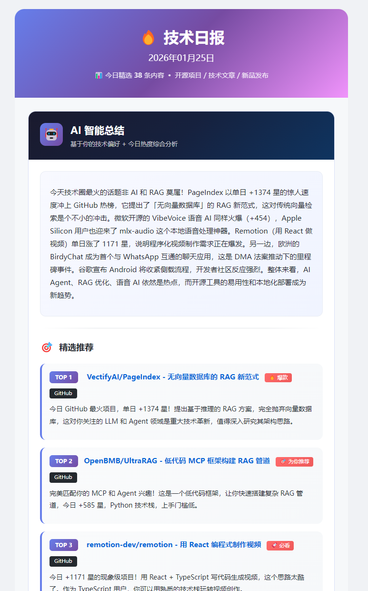
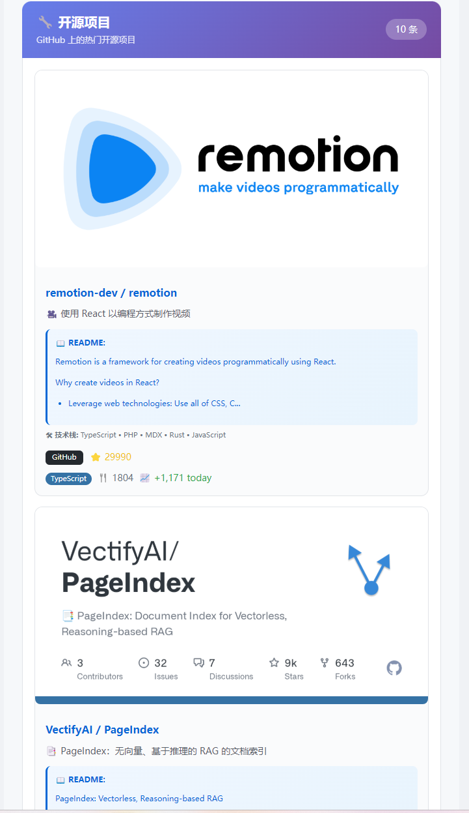
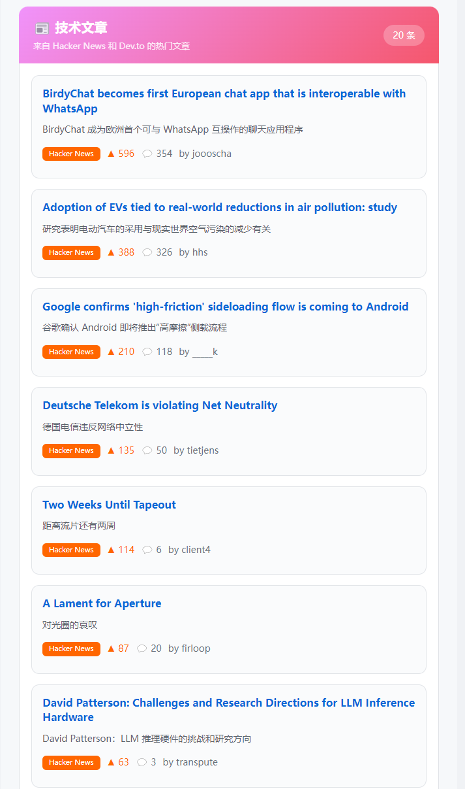
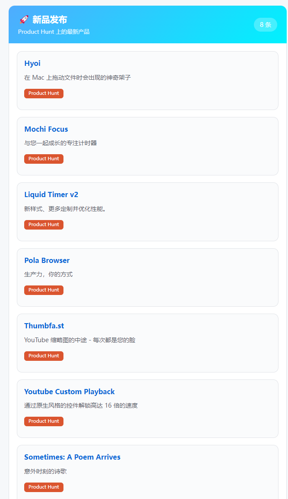

<p align="center">
  
</p>

<h1 align="center">Tech Digest Daily</h1>

<p align="center">
  <b>🤖 AI 驱动的多源技术资讯聚合平台</b><br>
  <sub>每天早上 7 点，自动推送来自 GitHub、Hacker News、Product Hunt、Dev.to 的热门资讯到你的邮箱</sub>
</p>

<p align="center">
  
  
  
  
</p>

<p align="center">
  <a href="#-核心特性">核心特性</a> •
  <a href="#-效果预览">效果预览</a> •
  <a href="#-快速部署">快速部署</a> •
  <a href="#️-配置说明">配置说明</a> •
  <a href="#-常见问题">常见问题</a>
</p>

---

## 🎯 这是什么？

**Tech Digest Daily** 是一个**全自动的技术资讯聚合系统**：

- 🔄 **自动抓取** - 每天自动从 4 大技术平台获取最新热门内容
- 🤖 **AI 智能总结** - 使用 LLM 生成个性化的技术趋势分析
- 📧 **邮件推送** - 精美的 HTML 邮件，支持 Resend/SMTP
- 🎯 **个性化推荐** - 基于你的 GitHub 偏好，推荐最相关的内容
- 🆓 **完全免费** - 基于 GitHub Actions，无需服务器

---

## ✨ 核心特性

### 📊 四大数据源聚合

| 数据源 | 内容类型 | 获取数量 |
|--------|----------|----------|
| **GitHub Trending** | 热门开源项目 | 15 个 |
| **Hacker News** | 技术文章/讨论 | 10 篇 |
| **Product Hunt** | 新产品发布 | 8 个 |
| **Dev.to** | 技术博客文章 | 10 篇 |

### 🤖 AI 智能功能

- **📝 每日总结** - AI 自动分析当日技术圈热点趋势
- **🎯 个性化推荐 TOP 5** - 根据你的 GitHub Star、自有仓库分析兴趣偏好
- **💡 推荐理由** - 每个推荐都会说明为什么适合你
- **🏷️ 智能标签** - 自动标记「🔥 爆款」「📈 飙升」「💎 宝藏」等

### 🔧 其他特性

- **🌏 中文翻译** - 所有内容自动翻译为中文
- **🔄 智能去重** - 内存 + 历史双重去重，不会重复推送
- **📖 深度信息** - 获取 README 摘要、技术栈分析
- **⚡ 并发获取** - 多数据源并行抓取，高效快速

---

## 📸 效果预览

### 🤖 AI 智能总结 + 个性化推荐

AI 会根据你的 GitHub 偏好，生成每日技术趋势总结和个性化推荐：

<p align="center">
  
</p>

### 🔧 GitHub 热门开源项目

展示今日 GitHub Trending 上最火的开源项目，包含 Star 数、今日增长、技术栈分析：

<p align="center">
  
</p>

### 📰 技术文章（Hacker News + Dev.to）

来自 Hacker News 和 Dev.to 的热门技术文章，帮你了解技术社区的讨论热点：

<p align="center">
  
</p>

### 🚀 新品发布（Product Hunt）

每天关注 Product Hunt 上的新产品，第一时间发现有趣的工具和服务：

<p align="center">
  
</p>

---

## 🚀 快速部署

只需 **5 分钟**，即可完成部署！

### 📋 准备工作

| 必需项 | 说明 | 获取方式 |
|--------|------|----------|
| GitHub 账号 | 用于 Fork 仓库和运行 Actions | [注册](https://github.com) |
| 邮箱地址 | 接收每日技术资讯 | 任意邮箱 |
| Resend API Key | 免费邮件发送服务 | [获取](https://resend.com)（1分钟） |

| 可选项 | 说明 | 用途 |
|--------|------|------|
| LLM API Key | AI 模型 API | 启用 AI 智能总结 |
| GitHub Token | GitHub API 访问令牌 | 获取个性化推荐所需的用户数据 |

---

### 第一步：Fork 仓库

1. 点击本页面右上角的 **`Fork`** 按钮
2. 点击 **`Create fork`** 确认创建
3. 等待几秒，你就拥有了自己的仓库副本

---

### 第二步：获取 Resend API Key

[Resend](https://resend.com) 是现代化的邮件发送服务，**免费额度每月 3000 封**！

1. 访问 https://resend.com
2. 点击 **`Start for free`** 或用 GitHub 登录
3. 进入 Dashboard → 点击 **`API Keys`**
4. 点击 **`Create API Key`**
5. 输入名称（如 `tech-digest`），点击 **`Add`**
6. ⚠️ **立即复制** 生成的 API Key（以 `re_` 开头）

---

### 第三步：配置 Secrets

进入你 Fork 的仓库：

**`Settings`** → **`Secrets and variables`** → **`Actions`** → **`New repository secret`**

#### 必需 Secrets

| Name | Value | 说明 |
|------|-------|------|
| `TO_EMAIL` | `your@email.com` | 接收邮件的邮箱地址 |
| `RESEND_API_KEY` | `re_xxxxxxxxxx` | Resend API Key |

#### 可选 Secrets（启用 AI 功能）

| Name | Value | 说明 |
|------|-------|------|
| `LLM_API_KEY` | `your-llm-api-key` | LLM API Key（用于 AI 总结） |
| `GH_USERNAME` | `your-github-username` | 你的 GitHub 用户名（用于个性化推荐） |
| `GITHUB_TOKEN` | `ghp_xxxxxxxxxx` | GitHub Token（提高 API 限额） |

> 💡 **提示**：不配置 AI 相关的 Secrets，系统也能正常工作，只是不会有 AI 总结和个性化推荐功能。

---

### 第四步：启用 Actions

1. 进入仓库的 **`Actions`** 选项卡
2. 点击 **`I understand my workflows, go ahead and enable them`**

---

### 第五步：测试运行 🎉

1. 点击 **`Actions`** → 选择 **`Tech Digest Daily`**
2. 点击右侧 **`Run workflow`**
3. 选择配置：
   - `启用 AI 总结`: `true`
   - `启用历史去重`: `false`（首次测试建议关闭）
4. 点击绿色 **`Run workflow`** 按钮
5. 等待 1-2 分钟
6. **去检查你的邮箱！** 📬

---

## ⚙️ 配置说明

### 环境变量一览

| 变量 | 必需 | 默认值 | 说明 |
|------|:----:|--------|------|
| `TO_EMAIL` | ✅ | - | 接收邮件的邮箱 |
| `RESEND_API_KEY` | ✅ | - | Resend API Key |
| `LLM_API_KEY` | ❌ | - | LLM API Key |
| `GITHUB_USERNAME` | ❌ | - | GitHub 用户名 |
| `GITHUB_TOKEN` | ❌ | - | GitHub Token |
| `ENABLE_AI_SUMMARY` | ❌ | `true` | 是否启用 AI 总结 |
| `ENABLE_HISTORY_DEDUP` | ❌ | `true` | 是否启用历史去重 |
| `ENABLE_GITHUB` | ❌ | `true` | 启用 GitHub 数据源 |
| `ENABLE_HACKERNEWS` | ❌ | `true` | 启用 Hacker News |
| `ENABLE_PRODUCTHUNT` | ❌ | `true` | 启用 Product Hunt |
| `ENABLE_DEVTO` | ❌ | `true` | 启用 Dev.to |
| `GITHUB_LIMIT` | ❌ | `15` | GitHub 获取数量 |
| `HACKERNEWS_LIMIT` | ❌ | `10` | HN 获取数量 |
| `PRODUCTHUNT_LIMIT` | ❌ | `8` | PH 获取数量 |
| `DEVTO_LIMIT` | ❌ | `10` | Dev.to 获取数量 |

### 修改发送时间

编辑 `.github/workflows/daily.yml`：

```yaml
schedule:
  - cron: '0 23 * * *'  # UTC 23:00 = 北京时间 07:00
```

**常用时间配置：**

| Cron | UTC | 北京时间 |
|------|-----|----------|
| `'0 23 * * *'` | 23:00 | **07:00** |
| `'0 0 * * *'` | 00:00 | 08:00 |
| `'0 1 * * *'` | 01:00 | 09:00 |

### 使用 SMTP 替代 Resend

如果你更喜欢使用 Gmail/QQ邮箱/163邮箱：

1. 添加 SMTP Secrets：

| Name | 示例值 |
|------|--------|
| `SMTP_SERVER` | `smtp.gmail.com` |
| `SMTP_PORT` | `465` |
| `SMTP_USER` | `your@gmail.com` |
| `SMTP_PASSWORD` | `xxxx xxxx xxxx xxxx` |

2. 修改 `daily.yml`，取消 SMTP 相关注释，注释掉 RESEND_API_KEY

---

## 📁 项目结构

```
github-trending-daily/
├── .github/workflows/
│   └── daily.yml              # GitHub Actions 定时任务
├── data/
│   └── history.json           # 历史去重数据
├── src/
│   ├── main.py                # 主程序入口
│   ├── models.py              # 统一数据模型
│   ├── email_sender.py        # 邮件发送
│   ├── sources/               # 数据源模块
│   │   ├── github_trending.py # GitHub Trending
│   │   ├── hackernews.py      # Hacker News
│   │   ├── producthunt.py     # Product Hunt
│   │   ├── devto.py           # Dev.to
│   │   └── depth_fetcher.py   # 深度信息获取
│   ├── ai/                    # AI 模块
│   │   ├── llm_client.py      # LLM 客户端
│   │   ├── github_profile.py  # GitHub 用户偏好
│   │   └── summarizer.py      # AI 总结生成器
│   ├── dedup/                 # 去重模块
│   │   ├── memory.py          # 内存去重
│   │   └── history.py         # 历史去重
│   ├── templates/             # 邮件模板
│   └── core/                  # 核心模块
│       └── logger.py          # 日志系统
└── requirements.txt           # Python 依赖
```

---

## ❓ 常见问题

<details>
<summary><b>Q: 没有收到邮件怎么办？</b></summary>

1. **检查垃圾邮件** - 首次邮件可能在垃圾箱
2. **检查 Actions 状态** - 进入 Actions 查看是否运行失败
3. **查看运行日志** - 点击具体的 run 查看详细错误信息
4. **验证 Secrets** - 确保 `TO_EMAIL` 和 `RESEND_API_KEY` 配置正确

</details>

<details>
<summary><b>Q: AI 总结没有生成？</b></summary>

确保已配置：
- `LLM_API_KEY` - LLM API 密钥
- `ENABLE_AI_SUMMARY` - 设置为 `true`

如果没有配置 LLM API Key，系统会跳过 AI 总结功能，但其他功能正常工作。

</details>

<details>
<summary><b>Q: 个性化推荐不准确？</b></summary>

个性化推荐需要配置：
- `GH_USERNAME` - 你的 GitHub 用户名
- `GITHUB_TOKEN` - GitHub Token（提高 API 限额）

系统会分析你的：
- ⭐ Star 过的仓库（代表兴趣方向）
- 📦 自己的仓库（代表技术专长，权重 x3）

</details>

<details>
<summary><b>Q: 为什么选择 Resend？</b></summary>

- ✅ **免费额度充足** - 每月 3000 封
- ✅ **无需验证域名** - 即刻可用
- ✅ **API 简洁** - 一个 HTTP 请求搞定
- ✅ **送达率高** - 专业邮件服务

</details>

<details>
<summary><b>Q: GitHub Actions 收费吗？</b></summary>

**不收费！** 公开仓库的 GitHub Actions 完全免费，无分钟数限制。

</details>

<details>
<summary><b>Q: 如何关闭某个数据源？</b></summary>

在 `.github/workflows/daily.yml` 中修改对应开关：

```yaml
ENABLE_GITHUB: 'false'      # 关闭 GitHub
ENABLE_HACKERNEWS: 'false'  # 关闭 Hacker News
ENABLE_PRODUCTHUNT: 'false' # 关闭 Product Hunt
ENABLE_DEVTO: 'false'       # 关闭 Dev.to
```

</details>

---

## 🤝 贡献

欢迎提交 Issue 和 Pull Request！

- 🐛 发现 Bug？[提交 Issue](../../issues/new)
- 💡 有新想法？[参与讨论](../../discussions)
- 🔧 想改进代码？[提交 PR](../../pulls)

---

## 📄 许可证

[MIT License](LICENSE) © 2025

---

<p align="center">
  如果这个项目对你有帮助，请给一个 ⭐ Star 支持一下！
</p>

<p align="center">
  Made with ❤️ by <a href="https://github.com/kkkano">kkkano</a>
</p>
